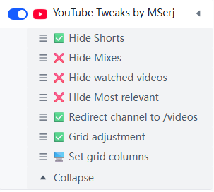

# YouTube Tweeks by MSerj

A single configurable userscript that combines several YouTube layout, navigation, and playback enhancements.

## Features

All features are controlled from the userscript menu and can be enabled or disabled independently:

- **Hide Shorts** - Removes Shorts navigation entries, shelves, tabs, and videos.
- **Hide Mixes** - Removes Mix recommendations and Mix tabs.
- **Hide watched videos** - Removes fully watched videos from feed lists.
- **Hide Most relevant** - Removes the Most relevant shelf, enabled by default.
- **Redirect channel to /videos** - Opens a channel's main page directly on its Videos tab. Existing channel tabs such as Community, Live, Playlists, Search, Podcasts, Shorts, and Streams are not redirected.
- **Prevent timestamp scroll** - Seeks to timestamps in descriptions, comments, and chapters without allowing YouTube to scroll back to the top.
- **Grid adjustment** - Enables the custom desktop grid layout.
- **Set grid columns** - Sets the number of videos displayed per row from 1 to 10.

The default configuration hides Shorts and Most relevant, redirects channel pages to `/videos`, prevents timestamp scrolling, and enables grid adjustment. Mixes and watched videos are visible by default.

## Installation

Install `index.js` with a userscript manager such as ScriptCat, Tampermonkey, Violentmonkey, or Greasemonkey.
